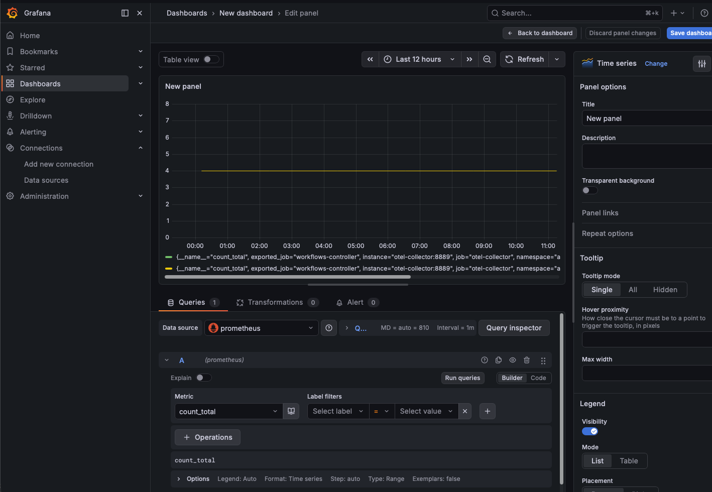
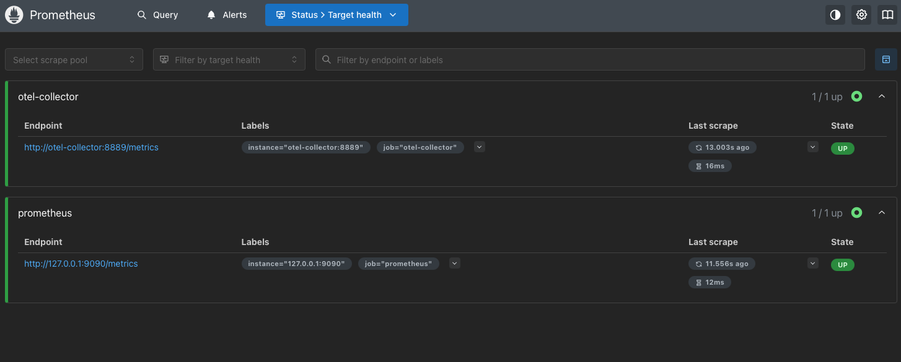
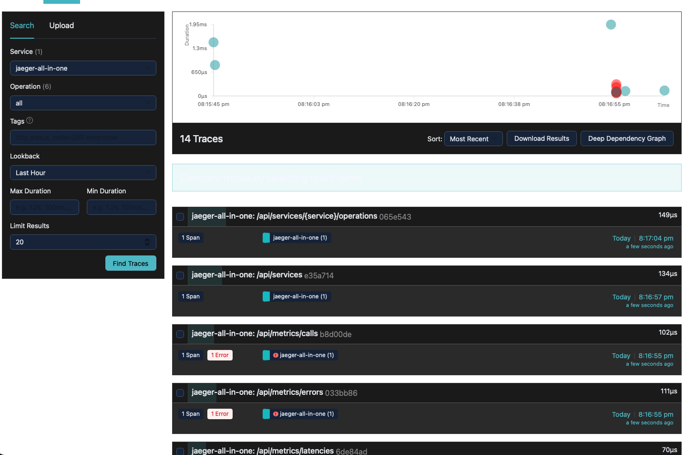
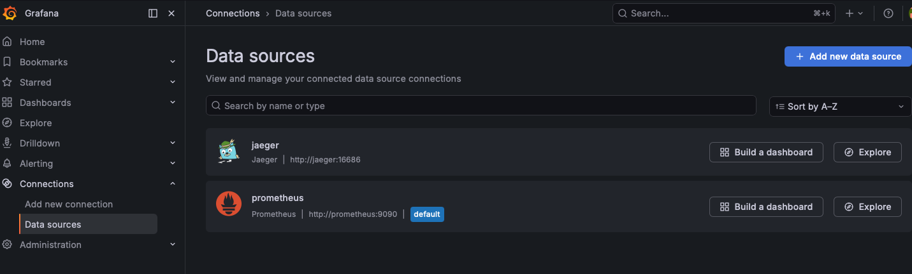

# Platform Observability Stack

## Overview

Full-stack observability platform deployed on Kubernetes using OpenTelemetry, Jaeger, Prometheus, and Grafana. Receives live telemetry from the [Argo Events CI/CD Pipeline](https://github.com/SmartBrisco/argo-event-pipeline), providing distributed tracing, metrics collection, and unified dashboards across the platform.

This is Project 3 of a connected platform engineering portfolio — the observability layer that gives the entire platform eyes.

## Architecture

```
Argo Workflows (Project 1)
        ↓
OTLP gRPC (port 4317)
        ↓
OpenTelemetry Collector
        ├── Traces → Jaeger (port 4317)
        └── Metrics → Prometheus Exporter (port 8889)
                          ↓
                     Prometheus scrapes (port 9090)
                          ↓
                     Grafana Dashboards (port 3000)
                          ├── Prometheus data source
                          └── Jaeger data source
```

## Components

**OpenTelemetry Collector** is the central telemetry pipeline. Receives traces and metrics from Argo Workflows via OTLP gRPC, processes them through a batch processor, and exports traces to Jaeger and metrics to a Prometheus-compatible endpoint. Acts as the single ingestion point for all platform telemetry.

**Jaeger** provides distributed tracing storage and visualization. Receives traces from the OTel collector and provides a UI for searching spans, visualizing trace timelines, and understanding request latency across workflow steps.

**Prometheus** scrapes metrics from the OTel collector's Prometheus exporter endpoint every 15 seconds. Stores time series data for workflow execution counts, error rates, pod lifecycle events, and Kubernetes API call durations.

**Grafana** connects to both Prometheus and Jaeger as data sources, providing unified dashboards for platform health visualization. Argo workflow metrics are plotted over time showing Running, Succeeded, and Failed phase counts.

## Kubernetes Namespace Strategy

All observability components run in a dedicated `monitoring` namespace, isolated from the Argo pipeline namespaces (`argo`, `argo-events`, `argo-workflows`). Cross-namespace communication uses full Kubernetes DNS names:

```
otel-collector.monitoring.svc.cluster.local
```

RBAC isolation ensures a compromised observability component cannot interact with pipeline infrastructure and vice versa.

## Repository Structure

```
platform-observability/
├── k8s/
│   ├── jaeger.yaml                  # Jaeger Deployment and Service
│   ├── prometheus-config.yaml       # Prometheus ConfigMap
│   ├── prometheus.yaml              # Prometheus Deployment and Service
│   ├── grafana.yaml                 # Grafana Deployment and Service
│   ├── otel-collector-config.yaml   # OTel Collector ConfigMap
│   └── otel-collector.yaml          # OTel Collector Deployment and Service
├── src/
│   ├── grafana_dashboard.png        # Grafana Dashboard
│   ├── grafana_data_sources.png     # Grafana Data Sources
│   ├── jaeger_trace.pmg             # Jaeger Trace
│   ├── prometheus_targets.png       # Prometheus Targets
└── README.md
```

## Prerequisites

- Kubernetes cluster (kind recommended for local development)
- kubectl configured
- Helm installed
- [Argo Events CI/CD Pipeline](https://github.com/SmartBrisco/argo-event-pipeline) running on the same cluster
- Argo Workflows workflow-controller configured with OTLP endpoint

## Setup

### 1. Create monitoring namespace

```bash
kubectl create namespace monitoring
```

### 2. Deploy in order — backends first, collector last

```bash
# Deploy Jaeger
kubectl apply -f k8s/jaeger.yaml

# Deploy Prometheus
kubectl apply -f k8s/prometheus-config.yaml
kubectl apply -f k8s/prometheus.yaml

# Deploy Grafana
kubectl apply -f k8s/grafana.yaml

# Deploy OTel Collector
kubectl apply -f k8s/otel-collector-config.yaml
kubectl apply -f k8s/otel-collector.yaml
```

### 3. Verify all pods are running

```bash
kubectl get pods -n monitoring
```

Expected output:
```
NAME                              READY   STATUS    RESTARTS   AGE
grafana-xxx                       1/1     Running   0          Xs
jaeger-xxx                        1/1     Running   0          Xs
otel-collector-xxx                1/1     Running   0          Xs
prometheus-xxx                    1/1     Running   0          Xs
```

### 4. Configure Argo Workflows to send telemetry

Export and edit the workflow-controller deployment:

```bash
kubectl get deployment workflow-controller -n argo -o yaml > workflow-controller.yaml
```

Add these environment variables to the container spec:

```yaml
env:
- name: LEADER_ELECTION_IDENTITY
  valueFrom:
    fieldRef:
      apiVersion: v1
      fieldPath: metadata.name
- name: OTEL_EXPORTER_OTLP_ENDPOINT
  value: "http://otel-collector.monitoring.svc.cluster.local:4317"
- name: OTEL_EXPORTER_OTLP_INSECURE
  value: "true"
```

Apply and verify:

```bash
kubectl apply -f workflow-controller.yaml
kubectl get pods -n argo
```

### 5. Connect Grafana data sources

Port forward Grafana:

```bash
kubectl port-forward svc/grafana 3000:3000 -n monitoring
```

Open `http://localhost:3000` — login with admin/admin.

Go to Connections → Data Sources → Add new data source:

**Prometheus:**
- URL: `http://prometheus:9090`
- Save and Test

**Jaeger:**
- URL: `http://jaeger:16686`
- Save and Test

### 6. Access all UIs

```bash
kubectl port-forward svc/jaeger 16686:16686 -n monitoring &
kubectl port-forward svc/prometheus 9090:9090 -n monitoring &
kubectl port-forward svc/grafana 3000:3000 -n monitoring &
kubectl port-forward svc/otel-collector 8889:8889 -n monitoring &
```

| Service    | URL                        |
|------------|----------------------------|
| Grafana    | http://localhost:3000       |
| Prometheus | http://localhost:9090       |
| Jaeger     | http://localhost:16686      |
| OTel Metrics | http://localhost:8889/metrics |

## Verifying the Pipeline

### Confirm metrics are flowing

```bash
curl http://localhost:8889/metrics | grep count_total
```

Expected output shows live Argo workflow metrics:
```
count_total{job="workflows-controller",namespace="argo-workflows",phase="Running"} 4
count_total{job="workflows-controller",namespace="argo-workflows",phase="Succeeded"} 4
```

### Confirm Prometheus is scraping

Go to `http://localhost:9090` → Status → Targets

Both `prometheus` and `otel-collector` targets should show **UP**.

### Trigger a workflow and observe

```bash
curl -d '{"message":"hello"}' -H "Content-Type: application/json" -X POST http://localhost:12000/push
```

Watch metrics update in Grafana dashboards within 15 seconds.

## Screenshots

### Grafana Dashboard — Argo Workflow Metrics


### Prometheus Targets — All UP


### Jaeger UI — Distributed Traces


### Grafana Data Sources — Prometheus and Jaeger Connected


## Design Decisions

**Why a dedicated monitoring namespace?**
RBAC isolation. Observability components have read access to platform metrics but no ability to interact with pipeline infrastructure. A compromised Grafana instance cannot affect Argo workflows. Blast radius is contained.

**Why OpenTelemetry Collector as a central pipeline?**
The collector decouples telemetry producers from backends. Argo sends OTLP to one endpoint. The collector fans out to Jaeger for traces and Prometheus for metrics. Adding a new backend requires only a collector config change, not changes to every application sending telemetry. 

**Why Prometheus scraping the OTel collector instead of scraping Argo directly?**
Argo v4 emits telemetry via OTLP not the traditional Prometheus /metrics endpoint. The OTel collector receives OTLP metrics and exposes them via a Prometheus-compatible exporter endpoint. The modern observability pattern is OTLP as the universal telemetry protocol, with the collector handling translation to legacy backends.

**Why deployment order matters?**
Jaeger and Prometheus must be running before the OTel collector starts. The collector needs destinations to export to on startup. Grafana connects to data sources after both are running. The correct order: backends → collector → visualization.

**Why Kubernetes Service DNS for inter-component communication?**
No hardcoded IP addresses anywhere. `http://prometheus:9090` resolves via Kubernetes DNS to the Prometheus Service ClusterIP regardless of pod restarts or rescheduling. This is how production Kubernetes workloads communicate — stable Service names not ephemeral pod IPs.

## Troubleshooting

**OTel collector target DOWN in Prometheus**
Verify port 8889 is exposed on the OTel collector Service. Check `kubectl get svc otel-collector -n monitoring` — should show `4317/TCP,8889/TCP`.

**No Argo metrics in Prometheus**
Confirm the workflow-controller deployment has `OTEL_EXPORTER_OTLP_ENDPOINT` and `OTEL_EXPORTER_OTLP_INSECURE` environment variables set. Check controller logs for `failed to upload metrics` errors — if present the OTel collector isn't accepting the connection.

**Workflow controller CrashLoopBackOff after config changes**
Argo v4 does not support the `telemetry` field in `workflow-controller-configmap`. Configure tracing via environment variables on the deployment directly, not through the ConfigMap.

**OTel collector not loading updated ConfigMap**
Delete the pod to force a fresh mount:
```bash
kubectl delete pod -l app=otel-collector -n monitoring
```

## Part of a Three-Project Platform Engineering Portfolio

- **Project 1** — [Argo Events CI/CD Pipeline](https://github.com/SmartBrisco/argo-event-pipeline) — Event-driven application pipeline with AI-powered failure analysis
- **Project 2** — [GitOps Infrastructure Pipeline](https://github.com/SmartBrisco/gitops-infra-pipeline) — GitHub Actions and Terraform infrastructure automation
- **Project 3** — Platform Observability Stack (this project) — Unified observability with OpenTelemetry, Jaeger, Prometheus, and Grafana
